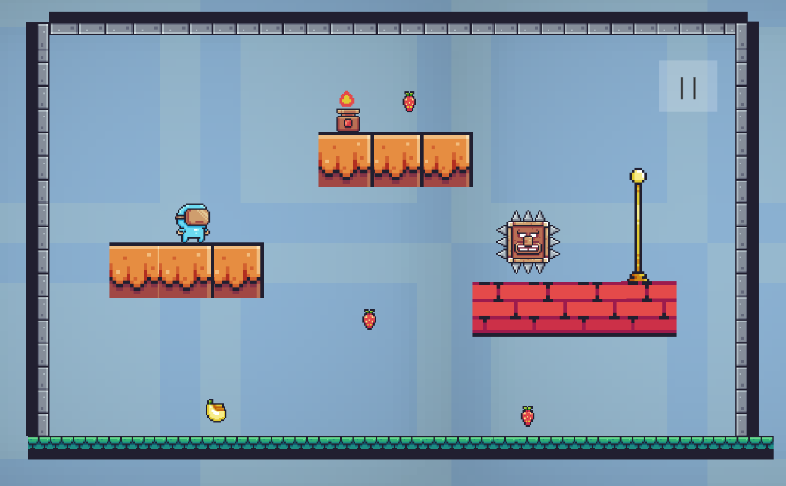
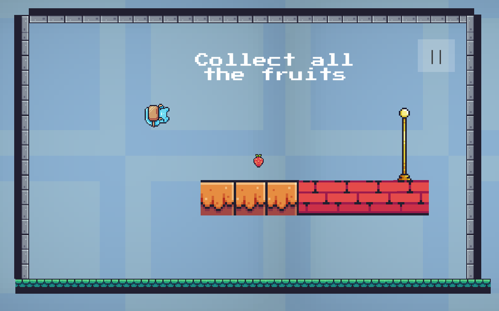
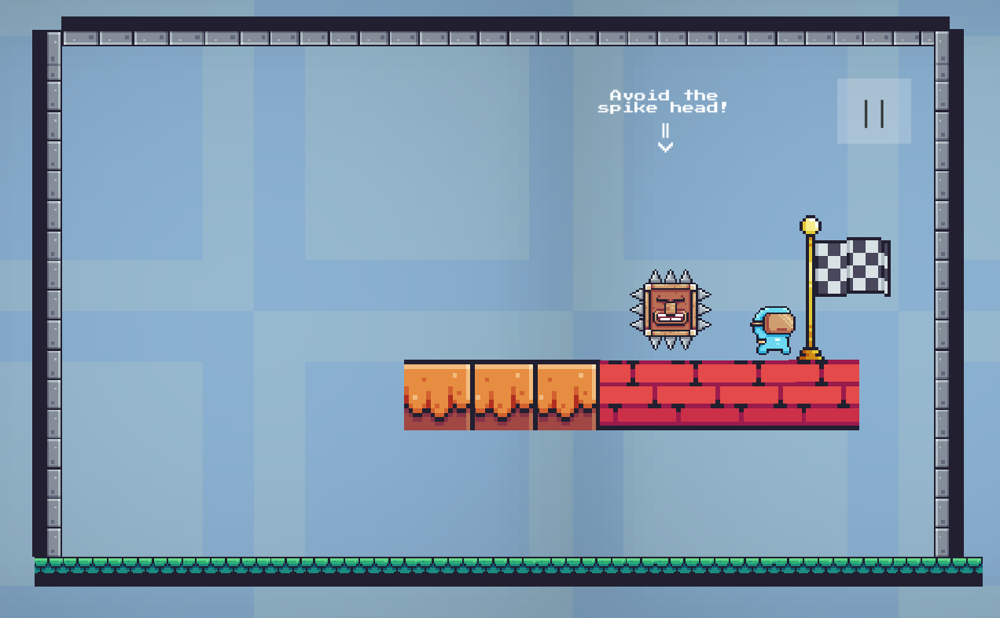
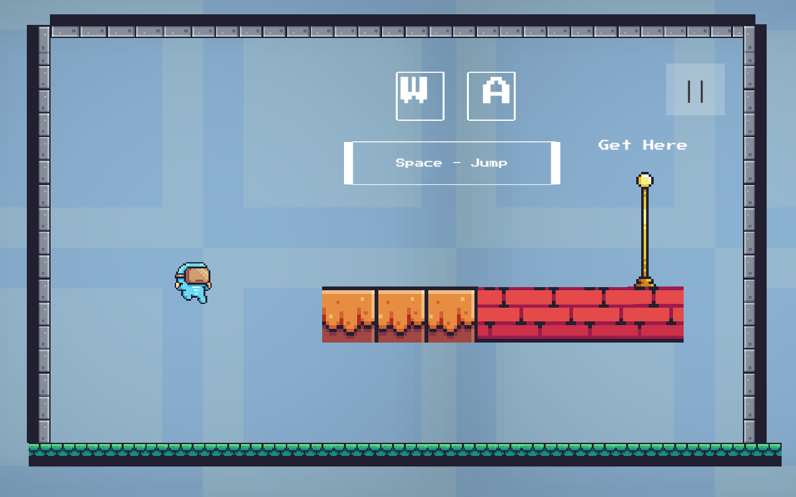

<h1>Pixelli</h1>
<h2>About</h2>

Pixelli is a 2D platformer game loosely inspired by Super Mario Bros and Waterboy and Firegirl. The objective of the game is to collect all the fruits in the level and reach the checkpoint without hitting spikeheads and fire switches. It was developed using the Unity Game Engine and C#.

<bold><a target="_blank" href="https://sarthakkamboj.itch.io/pixelli">Link To Game</a></bold>

<h2>Topics Learned</h2>
<li>2D Collision Detection</li>
<li>Manipulating animation system with states and statemachines</li>
<li>Programming advanced player movement</li>
<li>Advanced player movement</li>

 

<h2>Gameplay Screenshots</h2>

 

<h2>External Assets Used</h2>
Art: <a href="https://assetstore.unity.com/packages/2d/characters/pixel-adventure-1-155360">Pixel Adventure 1 Asset Pack</a>

 

Background Music: <a href="https://www.youtube.com/watch?v=mNLJMTRvyj8">Jazz In Paris, by Media Right Productions</a>
